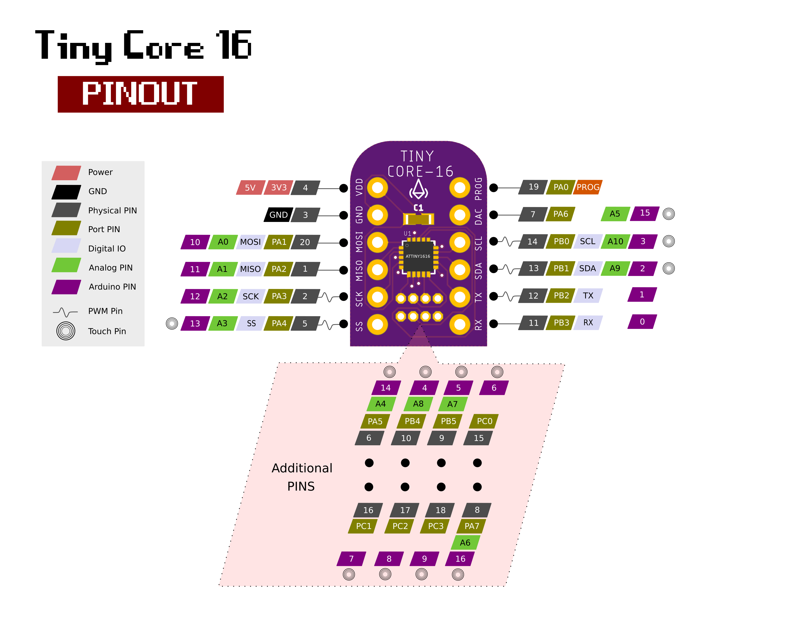

Arduino Core Support for Attiny 1 Series MCU
==============================================================================
# Links
  - [Documentation](https://docs.tinycore.dev)
  - [Tiny Core 16 Board]( https://www.tindie.com/products/16834/)
  - [Tiny Core 32 Board]( https://www.tindie.com/products/17279/)
  - [Programmer Board]( https://www.tindie.com/products/16835/)
  
# Feature
 Specifications |  .
------------ | -------------
Flash (program memory)   | 32/16 KB
RAM  | 2 KB
EEPROM | 256 bytes
Bootloader | No
GPIO Pins | 18
ADC Channels | 10
PWM Channels | 3
Peripheral | USART, SPI, I2C, Touch
Clock | 20 MHz
Power Consumption | min 2.9μA, max 10mA

# Arduino Support
 Function |  .
------------ | -------------
[UART](https://docs.tinycore.dev/en/latest/usage.html#uart)   | :heavy_check_mark:
[GPIO](https://docs.tinycore.dev/en/latest/usage.html#gpio)  | :heavy_check_mark:
ADC | :heavy_check_mark:
SPI | :heavy_check_mark:
I²C | :heavy_check_mark:
DAC | :heavy_check_mark:
Servo | :heavy_check_mark:
EEPROM | :heavy_check_mark:
NeoPixel | :heavy_check_mark:
Touch | :heavy_check_mark:
E-ink | :hourglass_flowing_sand:
Motor | :hourglass_flowing_sand:
 
 # Installation
- Install the current upstream Arduino IDE at the 1.8.7 level or later. The current version is at the [Arduino website](http://www.arduino.cc/en/main/software).
- Start Arduino and open Preferences window.
- Enter ```https://raw.githubusercontent.com/xukangmin/TinyCore/master/avr/package/package_tinycore_index.json``` into *Additional Board Manager URLs* field. You can add multiple URLs, separating them with commas.
- Open Boards Manager from Tools > Board menu and install *TinyCore* platform (and don't forget to select your TinyCore board from Tools > Board menu after installation).

# Programming

There are several ways to upload sketches.

**Upload through TinyCore Programmer**

* Select related com port number and click upload directly, same as programming Arduino Uno


**Upload through Arduino Uno or similar boards**

1. Connect Arduno Uno and Tiny Core boards as described [here](https://github.com/ElTangas/jtag2updi).
2. Arduin IDE->Tools->Programmer->Arduino PIN as UPDI
3. Arduin IDE->Sketch->Upload using programer

**Upload through Atmel-ICE Programmer**

1. Connect Atmel-ICE UPDI, VTG and GND PIN to TinyCore, supply TinyCore with external voltage, either 3.3V or 5V.
2. Make sure the green light on Atmel-ICE is on, that means target is properly powered
3. Arduin IDE->Tools->Programer->Atmel-ICE-UPDI
4. Arduin IDE->Sketch->Upload using programer


# Pin Mapping

- Tiny Core 16 Pinout



- Tiny Core 32 Pinout


Please check [Documentation Site](https://docs.tinycore.dev) for more tutorials and API